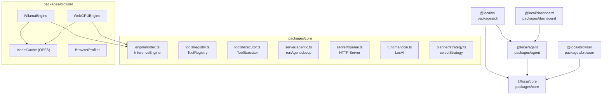
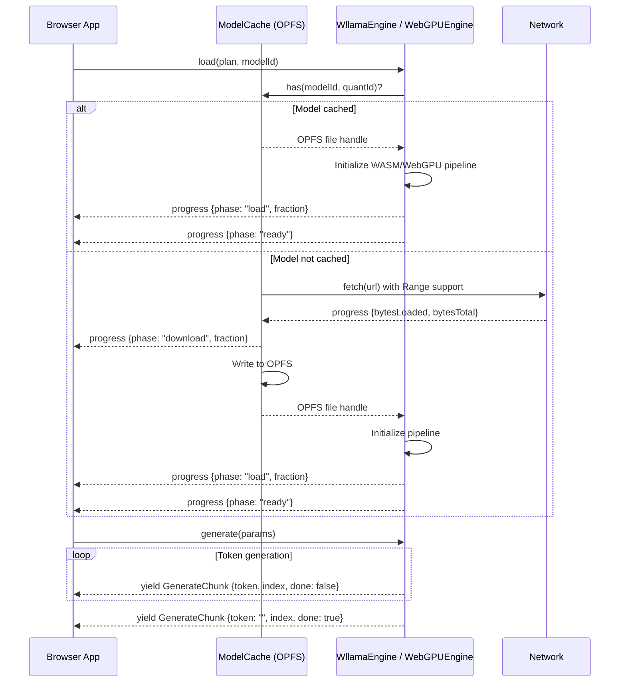

# Design Document: locai-agent-browser

## Overview

This design covers two major capabilities extending LocAI into an agentic coding tool and bringing inference to the browser:

1. **`lai` CLI + `@locai/agent` SDK + Dashboard Agent Tab** — A fully local, fully private agentic coding tool. The CLI is a terminal-native coding assistant. The SDK exposes the agentic loop as a composable library. The Dashboard gains an "Agent" tab for web-based agent interaction with approval flows.

2. **Browser Inference Engines** — Two new `InferenceEngine` implementations: a WASM engine (wllama) as universal fallback (Tier 5) and a WebGPU engine for GPU-accelerated inference (Tier 4). Both share an OPFS-based `ModelCache` and integrate with the existing strategy cascade.

### Key Design Decisions

| Decision | Choice | Rationale |
|----------|--------|-----------|
| CLI framework | Raw Node readline + ANSI escapes | Zero dependencies, matches project philosophy |
| Permission model | Gate function injected into ToolExecutor | Decouples approval UX from execution logic |
| Session storage | JSON files in `~/.locai/sessions/` | Simple, inspectable, no DB dependency |
| Browser engine lib | @wllama/wllama for WASM | Mature GGUF-in-browser, active maintenance |
| WebGPU approach | WebGPU compute shaders via web-llm | Best perf path for browser GPU inference |
| Model cache | Shared OPFS with deterministic paths | Both engines share files, no re-download |
| Agent SDK transport | SSE over HTTP to LocAI server | Reuses existing server infrastructure |
| Dashboard approval | Server-side pause with approval_required SSE event | Keeps state on server, dashboard is stateless |


## Architecture

### Package Dependency Graph




### Data Flow: CLI Agentic Loop with Permission Prompts

```mermaid
sequenceDiagram
    participant User
    participant CLI as LAI CLI (REPL)
    participant Gate as PermissionGate
    participant Server as LocAI Server
    participant Loop as runAgenticLoop
    participant Model as LLM Engine

    User->>CLI: "refactor auth module"
    CLI->>Server: POST /v1/chat/completions (tools + messages)
    Server->>Loop: start agentic loop
    Loop->>Model: generate(messages, tools)
    Model-->>Loop: tool_call: file_read("src/auth.ts")
    Loop-->>CLI: SSE: tool_call event
    Note over CLI: file_read is read-only, no approval needed
    Loop->>Loop: execute file_read
    Loop-->>CLI: SSE: tool_result event
    Loop->>Model: generate(messages + result)
    Model-->>Loop: tool_call: file_write("src/auth.ts", newContent)
    Loop-->>CLI: SSE: tool_call event
    CLI->>Gate: checkPermission("file_write", args)
    Gate->>User: Display diff, prompt [y/n/a]
    User->>Gate: "y"
    Gate-->>CLI: approved
    CLI->>Loop: resume execution
    Loop->>Loop: execute file_write
    Loop-->>CLI: SSE: tool_result
    Loop->>Model: generate(messages + result)
    Model-->>Loop: final answer (no tool_calls)
    Loop-->>CLI: SSE: token events + done
    CLI->>User: Display final answer
```

### Data Flow: Dashboard Agent Task with Approval

```mermaid
sequenceDiagram
    participant User
    participant Dashboard as Agent Tab
    participant Server as LocAI Server
    participant Loop as runAgenticLoop

    User->>Dashboard: Submit task "add tests for utils"
    Dashboard->>Server: POST /locai/agent/run {task, tools}
    Server->>Loop: start agentic loop (taskId generated)
    Loop-->>Dashboard: SSE: token events (streaming)
    Loop-->>Dashboard: SSE: tool_call {file_read}
    Loop-->>Dashboard: SSE: tool_result {file contents}
    Loop-->>Dashboard: SSE: tool_call {file_write}
    Server-->>Dashboard: SSE: approval_required {actionId, path, diff}
    Note over Dashboard: Show diff viewer, Approve/Reject buttons
    User->>Dashboard: Click "Approve"
    Dashboard->>Server: POST /locai/agent/approve {taskId, actionId, approved: true}
    Server->>Loop: resume with approval
    Loop-->>Dashboard: SSE: tool_result {write success}
    Loop-->>Dashboard: SSE: done {finalAnswer, iterations}
```


### Data Flow: Browser Engine Model Loading and Inference




## Components and Interfaces

### File Structure

```
packages/
├── cli/                          # @locai/cli — the `lai` binary
│   ├── package.json
│   ├── bin/
│   │   └── lai.ts                # Entry point, shebang, arg parsing
│   └── src/
│       ├── repl.ts               # Interactive REPL loop
│       ├── context.ts            # Project context scanner
│       ├── permission.ts         # PermissionGate implementation
│       ├── session.ts            # Session persistence (save/load/list)
│       ├── prompt-builder.ts     # System prompt construction
│       ├── renderer.ts           # Terminal output (streaming, colors, diffs)
│       ├── quality.ts            # Quality warnings and success tracking
│       └── config.ts             # .lai.json / .lai.yaml loader
│
├── agent/                        # @locai/agent — the SDK
│   ├── package.json
│   └── src/
│       ├── index.ts              # Public exports
│       ├── runner.ts             # AgentRunner class
│       ├── events.ts             # Typed event definitions
│       ├── tools/                # Built-in coding tools
│       │   ├── index.ts          # Tool registration helper
│       │   ├── file-read.ts
│       │   ├── file-write.ts
│       │   ├── shell-exec.ts
│       │   ├── grep-search.ts
│       │   ├── git-status.ts
│       │   ├── git-diff.ts
│       │   └── web-fetch.ts
│       └── types.ts              # RunOptions, RunResult, AgentEvent
│
├── browser/                      # @locai/browser — browser inference engines
│   ├── package.json
│   └── src/
│       ├── index.ts              # Public exports
│       ├── wllama-engine.ts      # WllamaEngine (WASM)
│       ├── webgpu-engine.ts      # WebGPUEngine
│       ├── model-cache.ts        # Shared OPFS ModelCache
│       ├── profiler.ts           # Browser device profiler
│       └── types.ts              # Browser-specific types
│
├── core/src/
│   ├── server/
│   │   └── openai.ts            # + POST /locai/agent/run, /approve, /stop
│   └── tools/
│       └── coding-tools.ts      # Coding tool definitions (shared)
│
└── dashboard/src/
    └── components/
        └── agent/                # New Agent Tab components
            ├── AgentTab.tsx       # Main agent tab container
            ├── TaskInput.tsx      # Task submission form
            ├── EventLog.tsx       # Real-time event stream display
            ├── ApprovalCard.tsx   # Approval prompt with diff viewer
            ├── DiffViewer.tsx     # Side-by-side/unified diff
            └── useAgent.ts       # Hook for agent SSE stream
```


### Coding Tools Interface

All coding tools implement the existing `ToolDefinition` interface from `packages/core/src/tools/registry.ts`. They are defined in a shared module so both the CLI and SDK can register them.

```typescript
// packages/agent/src/tools/file-read.ts
import type { ToolDefinition } from "@locai/core/tools/registry";

export function makeFileReadTool(projectRoot: string): ToolDefinition {
  return {
    name: "file_read",
    description: "Read the contents of a file. Returns the file content as a string.",
    parameters: {
      type: "object",
      properties: {
        path: { type: "string", description: "Relative or absolute file path" },
        start_line: { type: "number", description: "Optional start line (1-indexed)" },
        end_line: { type: "number", description: "Optional end line (1-indexed)" },
      },
      required: ["path"],
    },
    async execute(args) {
      const filePath = resolvePath(projectRoot, args.path as string);
      const stat = await fs.stat(filePath);
      if (stat.size > 100 * 1024) {
        return JSON.stringify({
          error: "read_error",
          details: { reason: "size_exceeded", sizeBytes: stat.size },
          suggestion: "Use start_line/end_line to read a specific range",
        });
      }
      const content = await fs.readFile(filePath, "utf-8");
      // Apply line range if specified
      if (args.start_line || args.end_line) {
        const lines = content.split("\n");
        const start = ((args.start_line as number) ?? 1) - 1;
        const end = (args.end_line as number) ?? lines.length;
        return lines.slice(start, end).join("\n");
      }
      return content;
    },
  };
}
```

```typescript
// packages/agent/src/tools/file-write.ts
export function makeFileWriteTool(projectRoot: string): ToolDefinition {
  return {
    name: "file_write",
    description: "Write content to a file. Creates parent directories if needed.",
    parameters: {
      type: "object",
      properties: {
        path: { type: "string", description: "File path relative to project root" },
        content: { type: "string", description: "Full file content to write" },
      },
      required: ["path", "content"],
    },
    async execute(args) {
      const filePath = resolvePath(projectRoot, args.path as string);
      await fs.mkdir(path.dirname(filePath), { recursive: true });
      await fs.writeFile(filePath, args.content as string, "utf-8");
      return JSON.stringify({ success: true, path: filePath });
    },
  };
}
```


```typescript
// packages/agent/src/tools/shell-exec.ts
export function makeShellExecTool(projectRoot: string): ToolDefinition {
  return {
    name: "shell_exec",
    description: "Execute a shell command in the project root. Returns stdout, stderr, and exit code.",
    parameters: {
      type: "object",
      properties: {
        command: { type: "string", description: "Shell command to execute" },
      },
      required: ["command"],
    },
    async execute(args) {
      const command = args.command as string;
      const TIMEOUT_MS = 30_000;
      try {
        const { stdout, stderr } = await execAsync(command, {
          cwd: projectRoot,
          timeout: TIMEOUT_MS,
        });
        return JSON.stringify({ stdout, stderr, exitCode: 0 });
      } catch (err: any) {
        if (err.killed) {
          return JSON.stringify({ error: "timeout", message: "Command exceeded 30s timeout" });
        }
        return JSON.stringify({
          stdout: err.stdout ?? "",
          stderr: err.stderr ?? "",
          exitCode: err.code ?? 1,
        });
      }
    },
  };
}
```

```typescript
// packages/agent/src/tools/grep-search.ts
export function makeGrepSearchTool(projectRoot: string): ToolDefinition {
  return {
    name: "grep_search",
    description: "Search files for a regex pattern. Returns matching lines with file paths and line numbers.",
    parameters: {
      type: "object",
      properties: {
        pattern: { type: "string", description: "Regex pattern to search for" },
        path: { type: "string", description: "Directory to search in (relative to project root)" },
        include: { type: "string", description: "Glob pattern for files to include (e.g. '*.ts')" },
      },
      required: ["pattern"],
    },
    async execute(args) {
      const searchPath = resolvePath(projectRoot, (args.path as string) ?? ".");
      const pattern = args.pattern as string;
      const include = args.include as string | undefined;
      // Uses ripgrep if available, falls back to recursive grep
      const results = await grepFiles(searchPath, pattern, { include, respectGitignore: true });
      return JSON.stringify(results.slice(0, 50)); // Cap at 50 results
    },
  };
}
```


### Permission System

The permission system is a gate that intercepts destructive tool calls before execution. It is injected into the tool execution pipeline, decoupling the approval UX (terminal prompt vs. dashboard button) from the execution logic.

```typescript
// packages/agent/src/types.ts

export type PermissionDecision = "approve" | "deny" | "always";

export interface PermissionRequest {
  toolName: string;
  args: Record<string, unknown>;
  /** For file_write: the unified diff of proposed changes */
  diff?: string;
  /** For file_write: the target file path */
  targetPath?: string;
}

export interface PermissionGate {
  /**
   * Check whether a tool call requires approval and, if so, obtain it.
   * Returns "approve" to proceed, "deny" to skip, "always" to auto-approve
   * all future calls of this tool type for the session.
   */
  check(request: PermissionRequest): Promise<PermissionDecision>;
}

/** Tools that require permission before execution */
export const DESTRUCTIVE_TOOLS = new Set(["file_write", "shell_exec"]);

/** Tools that are always safe (read-only) */
export const SAFE_TOOLS = new Set([
  "file_read", "grep_search", "git_status", "git_diff", "web_fetch"
]);
```

```typescript
// packages/cli/src/permission.ts — CLI implementation

export class CliPermissionGate implements PermissionGate {
  private autoApproved = new Set<string>();

  constructor(private config: { autoApprove?: string[] }) {
    // Pre-populate from .lai.json config
    for (const tool of config.autoApprove ?? []) {
      this.autoApproved.add(tool);
    }
  }

  async check(request: PermissionRequest): Promise<PermissionDecision> {
    if (this.autoApproved.has(request.toolName)) return "approve";

    // Display the action to the user
    if (request.toolName === "file_write" && request.diff) {
      renderDiff(request.targetPath!, request.diff);
    } else if (request.toolName === "shell_exec") {
      renderCommand(request.args.command as string);
    }

    // Prompt: [y]es / [n]o / [a]lways
    const answer = await promptUser("Allow? [y/n/a]: ");
    switch (answer.toLowerCase()) {
      case "y": case "yes": return "approve";
      case "a": case "always":
        this.autoApproved.add(request.toolName);
        return "always";
      default: return "deny";
    }
  }
}
```


### AgentRunner SDK Class

```typescript
// packages/agent/src/runner.ts

import { EventEmitter } from "events";
import type { ToolDefinition } from "@locai/core/tools/registry";

export interface RunOptions {
  /** AbortSignal for cancellation */
  signal?: AbortSignal;
  /** Override max iterations for this run */
  maxIterations?: number;
  /** System prompt override */
  systemPrompt?: string;
}

export interface RunResult {
  finalAnswer: string;
  toolCallHistory: Array<{
    id: string;
    name: string;
    arguments: Record<string, unknown>;
    result: unknown;
  }>;
  iterations: number;
  tokenCount: { prompt: number; completion: number; total: number };
}

export interface AgentRunnerConfig {
  serverUrl?: string;       // default "http://localhost:8080"
  tools?: ToolDefinition[]; // custom tools to merge with built-ins
  maxIterations?: number;   // default 10
}

export type AgentEvent =
  | { type: "tool_call"; id: string; name: string; arguments: Record<string, unknown> }
  | { type: "tool_result"; id: string; name: string; result: unknown }
  | { type: "token"; content: string; stop: boolean }
  | { type: "thinking"; content: string }
  | { type: "error"; message: string; recoverable: boolean }
  | { type: "done"; finalAnswer: string; iterations: number; tokenCount: number };

export class AgentRunner extends EventEmitter {
  private serverUrl: string;
  private customTools: ToolDefinition[] = [];
  private maxIterations: number;

  constructor(config: AgentRunnerConfig = {}) {
    super();
    this.serverUrl = config.serverUrl ?? "http://localhost:8080";
    this.maxIterations = config.maxIterations ?? 10;
    if (config.tools) {
      for (const tool of config.tools) this.registerTool(tool);
    }
  }

  /**
   * Register a custom tool. Throws if name conflicts with built-in or existing custom tool.
   */
  registerTool(definition: ToolDefinition): void {
    // Validate JSON Schema
    if (!definition.parameters || typeof definition.parameters !== "object") {
      throw new Error(`Tool "${definition.name}": parameters must be a valid JSON Schema object`);
    }
    if (this.customTools.some((t) => t.name === definition.name)) {
      throw new Error(`Tool "${definition.name}" is already registered`);
    }
    if (BUILTIN_TOOL_NAMES.has(definition.name)) {
      throw new Error(`Tool "${definition.name}" conflicts with a built-in tool`);
    }
    this.customTools.push(definition);
  }

  /**
   * Run an agentic task. Connects to the LocAI server via SSE and emits events.
   */
  async run(task: string, options?: RunOptions): Promise<RunResult> {
    const signal = options?.signal;
    const toolNames = [...BUILTIN_TOOL_NAMES, ...this.customTools.map((t) => t.name)];

    const response = await fetch(`${this.serverUrl}/locai/agent/run`, {
      method: "POST",
      headers: { "Content-Type": "application/json" },
      body: JSON.stringify({
        task,
        tools: toolNames,
        maxIterations: options?.maxIterations ?? this.maxIterations,
      }),
      signal,
    });

    if (!response.ok || !response.body) {
      throw new Error(`Agent API ${response.status}: ${response.statusText}`);
    }

    // Parse SSE stream and emit typed events
    return this.consumeStream(response.body, signal);
  }

  private async consumeStream(
    body: ReadableStream<Uint8Array>,
    signal?: AbortSignal
  ): Promise<RunResult> {
    // ... SSE parsing, event emission, result accumulation
    // Each SSE event is parsed and emitted as a typed AgentEvent
    // The final "done" event provides the RunResult
  }
}

const BUILTIN_TOOL_NAMES = new Set([
  "file_read", "file_write", "shell_exec",
  "grep_search", "git_status", "git_diff", "web_fetch",
]);
```


### LAI CLI REPL Loop

```typescript
// packages/cli/src/repl.ts

import readline from "node:readline";
import { AgentRunner } from "@locai/agent";
import { CliPermissionGate } from "./permission.ts";
import { SessionManager } from "./session.ts";
import { buildSystemPrompt } from "./prompt-builder.ts";
import { scanProjectContext } from "./context.ts";
import { CliRenderer } from "./renderer.ts";

export interface ReplOptions {
  serverUrl: string;
  projectRoot: string;
  sessionId?: string;       // Resume existing session
  initialTask?: string;     // One-shot task from CLI args
  config: LaiConfig;
}

export async function startRepl(opts: ReplOptions): Promise<void> {
  const context = await scanProjectContext(opts.projectRoot);
  const systemPrompt = buildSystemPrompt(context, opts.config);
  const gate = new CliPermissionGate(opts.config);
  const renderer = new CliRenderer();
  const sessions = new SessionManager();

  // Load or create session
  const session = opts.sessionId
    ? await sessions.load(opts.sessionId)
    : sessions.create(opts.projectRoot);

  // Display startup banner
  renderer.banner(session, context);

  // Quality warning check
  if (context.modelCapability < 0.70) {
    renderer.qualityWarning(context.modelName, context.modelCapability);
  }

  const runner = new AgentRunner({
    serverUrl: opts.serverUrl,
    maxIterations: 10,
  });

  // Wire up events to renderer
  runner.on("tool_call", (e) => renderer.toolCall(e.name, e.arguments));
  runner.on("tool_result", (e) => renderer.toolResult(e.name, e.result));
  runner.on("token", (e) => renderer.token(e.content, e.stop));
  runner.on("thinking", (e) => renderer.thinking(e.content));

  const rl = readline.createInterface({ input: process.stdin, output: process.stdout });

  // If initial task provided, run it first
  if (opts.initialTask) {
    await executeTask(opts.initialTask, runner, session, gate, renderer);
  }

  // Interactive loop
  for await (const line of rl) {
    const input = line.trim();
    if (!input) continue;
    if (input === "exit" || input === "quit") break;

    await executeTask(input, runner, session, gate, renderer);
  }

  // Persist session on exit
  await sessions.save(session);
  renderer.goodbye();
}
```

### Session Persistence

```typescript
// packages/cli/src/session.ts

export interface Session {
  id: string;
  projectPath: string;
  createdAt: string;
  lastActiveAt: string;
  messages: ChatMessage[];
}

export class SessionManager {
  private dir = path.join(os.homedir(), ".locai", "sessions");

  create(projectPath: string): Session {
    const projectName = path.basename(projectPath);
    const timestamp = new Date().toISOString().replace(/[:.]/g, "-").slice(0, 19);
    return {
      id: `${projectName}-${timestamp}`,
      projectPath,
      createdAt: new Date().toISOString(),
      lastActiveAt: new Date().toISOString(),
      messages: [],
    };
  }

  async save(session: Session): Promise<void> {
    session.lastActiveAt = new Date().toISOString();
    const filePath = path.join(this.dir, `${session.id}.json`);
    await fs.mkdir(this.dir, { recursive: true });
    await fs.writeFile(filePath, JSON.stringify(session, null, 2));
  }

  async load(sessionId: string): Promise<Session> {
    const filePath = path.join(this.dir, `${sessionId}.json`);
    const content = await fs.readFile(filePath, "utf-8");
    return JSON.parse(content);
  }

  async loadMostRecent(): Promise<Session | null> {
    const files = await fs.readdir(this.dir).catch(() => []);
    if (files.length === 0) return null;
    // Sort by modification time, return newest
    const sorted = await Promise.all(
      files.map(async (f) => ({
        name: f,
        mtime: (await fs.stat(path.join(this.dir, f))).mtimeMs,
      }))
    );
    sorted.sort((a, b) => b.mtime - a.mtime);
    return this.load(sorted[0].name.replace(".json", ""));
  }

  async list(): Promise<Array<{ id: string; createdAt: string; preview: string; projectPath: string }>> {
    const files = await fs.readdir(this.dir).catch(() => []);
    const sessions: Array<{ id: string; createdAt: string; preview: string; projectPath: string }> = [];
    for (const f of files) {
      const session = JSON.parse(await fs.readFile(path.join(this.dir, f), "utf-8"));
      const lastMsg = session.messages[session.messages.length - 1];
      sessions.push({
        id: session.id,
        createdAt: session.createdAt,
        preview: lastMsg?.content?.slice(0, 80) ?? "(empty)",
        projectPath: session.projectPath,
      });
    }
    return sessions;
  }

  /**
   * Summarize older messages when history exceeds token limit.
   * Preserves the most recent 10 messages verbatim.
   */
  async compact(session: Session, maxTokens: number): Promise<void> {
    const totalTokens = estimateTokens(session.messages);
    if (totalTokens <= maxTokens) return;

    const preserve = session.messages.slice(-10);
    const older = session.messages.slice(0, -10);

    // Summarize older messages into a single system message
    const summary = await summarizeMessages(older);
    session.messages = [
      { role: "system", content: `Previous conversation summary: ${summary}` },
      ...preserve,
    ];
  }
}
```


### WASM Engine (WllamaEngine)

```typescript
// packages/browser/src/wllama-engine.ts

import type { InferenceEngine, EngineInfo, GenerateParams, GenerateChunk } from "@locai/core/engine";
import type { RunPlan } from "@locai/core/types";
import { ModelCache } from "./model-cache.ts";

export interface WllamaEngineOptions {
  /** Base URL for wllama WASM files (default: bundled) */
  wasmBaseUrl?: string;
}

export interface LoadProgressEvent {
  phase: "download" | "load" | "ready";
  bytesLoaded?: number;
  bytesTotal?: number;
  fraction: number;
}

export class WllamaEngine implements InferenceEngine {
  readonly info: EngineInfo = {
    name: "wllama",
    backends: ["wasm"],
    available: typeof WebAssembly !== "undefined",
  };

  private wllama: any | null = null; // Wllama instance
  private loaded = false;
  private cache: ModelCache;
  private onProgress?: (event: LoadProgressEvent) => void;

  constructor(options?: WllamaEngineOptions & { onProgress?: (e: LoadProgressEvent) => void }) {
    this.cache = new ModelCache();
    this.onProgress = options?.onProgress;
  }

  supports(_plan: RunPlan): boolean {
    return this.info.available;
  }

  async load(plan: RunPlan, modelPath: string): Promise<void> {
    if (this.loaded) return;

    const modelId = plan.model.id;
    const quantId = plan.quant.id;

    // Get model from cache (downloads if needed)
    const modelBytes = await this.cache.getOrDownload(modelId, quantId, modelPath, {
      onProgress: (loaded, total) => {
        this.onProgress?.({ phase: "download", bytesLoaded: loaded, bytesTotal: total, fraction: loaded / total });
      },
    });

    this.onProgress?.({ phase: "load", fraction: 0 });

    // Initialize wllama
    const { Wllama } = await import("@wllama/wllama");
    this.wllama = new Wllama({ /* wasm paths */ });
    await this.wllama.loadModel(modelBytes);

    this.loaded = true;
    this.onProgress?.({ phase: "ready", fraction: 1 });
  }

  async *generate(params: GenerateParams): AsyncGenerator<GenerateChunk> {
    if (!this.wllama || !this.loaded) {
      throw new Error("Engine not loaded — call load() first");
    }

    let index = 0;
    const options = {
      nPredict: params.maxTokens ?? -1,
      temperature: params.temperature ?? 0.7,
      topP: params.topP ?? 0.95,
      topK: params.topK ?? 40,
      stop: params.stop ?? [],
    };

    // Use wllama's streaming completion
    await this.wllama.createCompletion(params.prompt, {
      ...options,
      onNewToken: (token: string, isEnd: boolean) => {
        // Tokens are yielded via the async generator pattern below
      },
    });

    // Wllama uses callback-based streaming; we bridge to async generator
    // via a queue pattern (actual implementation uses AsyncQueue)
    yield { token: "", index, done: true };
  }

  async unload(): Promise<void> {
    if (this.wllama) {
      await this.wllama.exit();
      this.wllama = null;
      this.loaded = false;
    }
  }

  /** List models currently cached in OPFS */
  async getCachedModels(): Promise<Array<{ modelId: string; quantId: string; sizeBytes: number }>> {
    return this.cache.list();
  }

  /** Remove a cached model from OPFS */
  async deleteModel(modelId: string, quantId: string): Promise<void> {
    return this.cache.delete(modelId, quantId);
  }
}
```


### WebGPU Engine (WebGPUEngine)

```typescript
// packages/browser/src/webgpu-engine.ts

import type { InferenceEngine, EngineInfo, GenerateParams, GenerateChunk } from "@locai/core/engine";
import type { RunPlan } from "@locai/core/types";
import { ModelCache } from "./model-cache.ts";
import type { LoadProgressEvent } from "./wllama-engine.ts";

export class WebGPUEngine implements InferenceEngine {
  readonly info: EngineInfo = {
    name: "webgpu-llama",
    backends: ["webgpu"],
    available: false, // Set during supports() probe
  };

  private device: GPUDevice | null = null;
  private pipeline: any | null = null; // WebGPU compute pipeline
  private loaded = false;
  private cache: ModelCache;
  private onProgress?: (event: LoadProgressEvent) => void;
  private adapterLimits: { maxBufferSize: number; maxStorageBufferBindingSize: number } | null = null;

  constructor(options?: { onProgress?: (e: LoadProgressEvent) => void }) {
    this.cache = new ModelCache();
    this.onProgress = options?.onProgress;
  }

  supports(plan: RunPlan): boolean {
    // Check WebGPU availability
    if (typeof navigator === "undefined" || !navigator.gpu) return false;

    // Check if adapter limits can fit the model
    if (this.adapterLimits) {
      const modelSizeBytes = (plan.model.paramsB * 1e9 * plan.quant.bitsPerWeight) / 8;
      if (modelSizeBytes > this.adapterLimits.maxBufferSize) return false;
    }

    return true;
  }

  /**
   * Probe GPU adapter limits. Must be called before supports() is meaningful.
   * Returns true if WebGPU is available and an adapter was obtained.
   */
  async probe(): Promise<boolean> {
    if (typeof navigator === "undefined" || !navigator.gpu) return false;

    try {
      const adapter = await navigator.gpu.requestAdapter();
      if (!adapter) return false;

      this.adapterLimits = {
        maxBufferSize: adapter.limits.maxBufferSize,
        maxStorageBufferBindingSize: adapter.limits.maxStorageBufferBindingSize,
      };

      (this.info as any).available = true;
      return true;
    } catch {
      return false;
    }
  }

  async load(plan: RunPlan, modelPath: string): Promise<void> {
    if (this.loaded) return;

    const modelId = plan.model.id;
    const quantId = plan.quant.id;

    // Get model from shared OPFS cache
    const modelBytes = await this.cache.getOrDownload(modelId, quantId, modelPath, {
      onProgress: (loaded, total) => {
        this.onProgress?.({ phase: "download", bytesLoaded: loaded, bytesTotal: total, fraction: loaded / total });
      },
    });

    this.onProgress?.({ phase: "load", fraction: 0 });

    // Request GPU device
    const adapter = await navigator.gpu!.requestAdapter();
    if (!adapter) throw new Error("No WebGPU adapter available");

    this.device = await adapter.requestDevice({
      requiredLimits: {
        maxBufferSize: adapter.limits.maxBufferSize,
        maxStorageBufferBindingSize: adapter.limits.maxStorageBufferBindingSize,
      },
    });

    // Initialize WebGPU compute pipelines for transformer inference
    // (Uses web-llm or custom WGSL shaders for matrix operations)
    this.pipeline = await initWebGPUPipeline(this.device, modelBytes);

    this.loaded = true;
    this.onProgress?.({ phase: "ready", fraction: 1 });

    // Handle device lost
    this.device.lost.then((info) => {
      this.loaded = false;
      this.device = null;
      // Emit error event for fallback handling
    });
  }

  async *generate(params: GenerateParams): AsyncGenerator<GenerateChunk> {
    if (!this.device || !this.pipeline || !this.loaded) {
      throw new Error("Engine not loaded — call load() first");
    }

    let index = 0;
    // WebGPU inference loop: tokenize → compute → sample → yield
    // Implementation uses compute shaders for attention + FFN
    for await (const token of this.pipeline.generate(params)) {
      yield { token: token.text, index: index++, done: token.isEnd };
      if (token.isEnd) return;
    }
    yield { token: "", index, done: true };
  }

  async unload(): Promise<void> {
    if (this.device) {
      this.device.destroy();
      this.device = null;
    }
    this.pipeline = null;
    this.loaded = false;
  }
}
```


### Shared ModelCache Class

```typescript
// packages/browser/src/model-cache.ts

/**
 * Shared OPFS-based model cache used by both WllamaEngine and WebGPUEngine.
 *
 * OPFS path convention: /models/{modelId}/{quantId}.gguf
 *
 * Features:
 * - Deduplicates concurrent downloads of the same model
 * - Supports HTTP Range for resumable downloads
 * - Falls back to in-memory if OPFS unavailable
 */

export interface DownloadOptions {
  onProgress?: (bytesLoaded: number, bytesTotal: number) => void;
}

export class ModelCache {
  private static activeDownloads = new Map<string, Promise<Uint8Array>>();
  private opfsAvailable: boolean | null = null;

  private cacheKey(modelId: string, quantId: string): string {
    return `${modelId}/${quantId}`;
  }

  private opfsPath(modelId: string, quantId: string): string {
    return `/models/${modelId}/${quantId}.gguf`;
  }

  /**
   * Get model bytes from OPFS cache, or download and cache.
   * Deduplicates concurrent requests for the same model.
   */
  async getOrDownload(
    modelId: string,
    quantId: string,
    url: string,
    options?: DownloadOptions
  ): Promise<Uint8Array> {
    const key = this.cacheKey(modelId, quantId);

    // Check if already downloading
    const active = ModelCache.activeDownloads.get(key);
    if (active) return active;

    // Check OPFS cache
    const cached = await this.loadFromOPFS(modelId, quantId);
    if (cached) return cached;

    // Start download (deduplicated)
    const downloadPromise = this.downloadAndCache(modelId, quantId, url, options);
    ModelCache.activeDownloads.set(key, downloadPromise);

    try {
      const result = await downloadPromise;
      return result;
    } finally {
      ModelCache.activeDownloads.delete(key);
    }
  }

  private async loadFromOPFS(modelId: string, quantId: string): Promise<Uint8Array | null> {
    if (!await this.isOPFSAvailable()) return null;

    try {
      const root = await navigator.storage.getDirectory();
      const modelsDir = await root.getDirectoryHandle("models");
      const modelDir = await modelsDir.getDirectoryHandle(modelId);
      const fileHandle = await modelDir.getFileHandle(`${quantId}.gguf`);
      const file = await fileHandle.getFile();
      return new Uint8Array(await file.arrayBuffer());
    } catch {
      return null; // Not cached
    }
  }

  private async downloadAndCache(
    modelId: string,
    quantId: string,
    url: string,
    options?: DownloadOptions
  ): Promise<Uint8Array> {
    // Check for partial download (resumable)
    const partialSize = await this.getPartialSize(modelId, quantId);

    const headers: Record<string, string> = {};
    if (partialSize > 0) {
      headers["Range"] = `bytes=${partialSize}-`;
    }

    const response = await fetch(url, { headers });
    if (!response.ok || !response.body) {
      throw new Error(`Download failed: ${response.status}`);
    }

    const totalSize = parseInt(response.headers.get("content-length") ?? "0") + partialSize;
    const reader = response.body.getReader();
    const chunks: Uint8Array[] = [];
    let loaded = partialSize;

    while (true) {
      const { done, value } = await reader.read();
      if (done) break;
      chunks.push(value);
      loaded += value.byteLength;
      options?.onProgress?.(loaded, totalSize);
    }

    // Combine chunks
    const fullBytes = concatUint8Arrays(chunks);

    // Store in OPFS (even if OPFS write fails, return the bytes for in-memory use)
    await this.saveToOPFS(modelId, quantId, fullBytes).catch(() => {
      console.warn("OPFS write failed — model loaded in memory only");
    });

    return fullBytes;
  }

  private async saveToOPFS(modelId: string, quantId: string, data: Uint8Array): Promise<void> {
    if (!await this.isOPFSAvailable()) return;

    const root = await navigator.storage.getDirectory();
    const modelsDir = await root.getDirectoryHandle("models", { create: true });
    const modelDir = await modelsDir.getDirectoryHandle(modelId, { create: true });
    const fileHandle = await modelDir.getFileHandle(`${quantId}.gguf`, { create: true });
    const writable = await fileHandle.createWritable();
    await writable.write(data);
    await writable.close();
  }

  async has(modelId: string, quantId: string): Promise<boolean> {
    return (await this.loadFromOPFS(modelId, quantId)) !== null;
  }

  async list(): Promise<Array<{ modelId: string; quantId: string; sizeBytes: number }>> {
    if (!await this.isOPFSAvailable()) return [];

    const results: Array<{ modelId: string; quantId: string; sizeBytes: number }> = [];
    const root = await navigator.storage.getDirectory();

    try {
      const modelsDir = await root.getDirectoryHandle("models");
      for await (const [modelId, modelHandle] of (modelsDir as any).entries()) {
        if (modelHandle.kind !== "directory") continue;
        for await (const [filename, fileHandle] of (modelHandle as any).entries()) {
          if (!filename.endsWith(".gguf")) continue;
          const file = await fileHandle.getFile();
          results.push({
            modelId,
            quantId: filename.replace(".gguf", ""),
            sizeBytes: file.size,
          });
        }
      }
    } catch {
      // models directory doesn't exist yet
    }

    return results;
  }

  async delete(modelId: string, quantId: string): Promise<void> {
    if (!await this.isOPFSAvailable()) return;
    const root = await navigator.storage.getDirectory();
    const modelsDir = await root.getDirectoryHandle("models");
    const modelDir = await modelsDir.getDirectoryHandle(modelId);
    await modelDir.removeEntry(`${quantId}.gguf`);
  }

  private async isOPFSAvailable(): Promise<boolean> {
    if (this.opfsAvailable !== null) return this.opfsAvailable;
    try {
      await navigator.storage.getDirectory();
      this.opfsAvailable = true;
    } catch {
      this.opfsAvailable = false;
    }
    return this.opfsAvailable;
  }

  private async getPartialSize(modelId: string, quantId: string): Promise<number> {
    // Check for a .partial file in OPFS for resume support
    return 0; // Simplified — full implementation tracks partial downloads
  }
}
```


### Browser Profiler

```typescript
// packages/browser/src/profiler.ts

import type { DeviceProfile, AcceleratorInfo } from "@locai/core/types";

/**
 * Profile the browser environment for strategy selection.
 * Detects WebGPU availability, memory estimates, and CPU capabilities.
 */
export async function profileBrowserDevice(): Promise<DeviceProfile> {
  const gpu = await probeWebGPU();
  const memory = estimateMemory();

  const accelerators: AcceleratorInfo[] = [];

  if (gpu.available) {
    accelerators.push({
      kind: "webgpu",
      name: gpu.adapterName,
      memoryBytes: gpu.maxBufferSize,
      unifiedMemory: true,
      available: true,
    });
  }

  accelerators.push({
    kind: "wasm",
    name: "WebAssembly (SIMD)",
    available: typeof WebAssembly !== "undefined",
  });

  return {
    platform: "browser",
    arch: detectArch(),
    totalRamBytes: memory.total,
    usableRamBytes: memory.usable,
    cpu: {
      brand: navigator.userAgent,
      physicalCores: navigator.hardwareConcurrency ?? 4,
      logicalCores: navigator.hardwareConcurrency ?? 4,
      features: detectSIMD() ? ["simd128"] : [],
    },
    accelerators,
    thermallyConstrained: /Mobile|Android|iPhone/.test(navigator.userAgent),
    capturedAt: new Date().toISOString(),
    source: "browser",
  };
}

async function probeWebGPU(): Promise<{
  available: boolean;
  adapterName: string;
  maxBufferSize: number;
}> {
  if (!navigator.gpu) return { available: false, adapterName: "", maxBufferSize: 0 };

  try {
    const adapter = await navigator.gpu.requestAdapter();
    if (!adapter) return { available: false, adapterName: "", maxBufferSize: 0 };

    return {
      available: true,
      adapterName: (adapter as any).name ?? "WebGPU Adapter",
      maxBufferSize: adapter.limits.maxBufferSize,
    };
  } catch {
    return { available: false, adapterName: "", maxBufferSize: 0 };
  }
}

function estimateMemory(): { total: number; usable: number } {
  // navigator.deviceMemory gives RAM in GiB (rounded, privacy-preserving)
  const deviceMemoryGB = (navigator as any).deviceMemory ?? 4;
  const total = deviceMemoryGB * 1024 * 1024 * 1024;
  // Browser can realistically use ~50% of reported memory
  const usable = total * 0.5;
  return { total, usable };
}
```

### Server Agent Endpoints

```typescript
// Additions to packages/core/src/server/openai.ts

/**
 * POST /locai/agent/run
 * Starts an agentic task with SSE streaming and approval flow.
 */
interface AgentRunRequest {
  task: string;
  tools?: string[];
  autoApprove?: boolean;
}

interface PendingApproval {
  actionId: string;
  toolName: string;
  args: Record<string, unknown>;
  resolve: (approved: boolean) => void;
}

// In-memory task state (per running task)
const activeTasks = new Map<string, {
  abortController: AbortController;
  pendingApprovals: Map<string, PendingApproval>;
}>();

// POST /locai/agent/run handler:
// 1. Generate taskId
// 2. Register coding tools in a fresh ToolRegistry
// 3. Wrap destructive tools with approval gate:
//    - When file_write or shell_exec is called:
//      a. Emit SSE: approval_required {actionId, toolName, args, diff}
//      b. Pause execution (await promise)
//      c. Resume when POST /locai/agent/approve resolves the promise
// 4. Run agentic loop, streaming all events as SSE
// 5. On completion, emit done event and clean up

// POST /locai/agent/approve handler:
// 1. Look up task by taskId
// 2. Find pending approval by actionId
// 3. Resolve the promise with approved: true/false
// 4. Return 200

// POST /locai/agent/stop handler:
// 1. Look up task by taskId
// 2. Call abortController.abort()
// 3. Clean up task state
// 4. Return 200
```


### Dashboard Agent Tab Components

```typescript
// packages/dashboard/src/components/agent/useAgent.ts

import { useState, useCallback, useRef } from "react";
import { readSSEStream } from "../../lib/stream-reader.ts";

export interface AgentEvent {
  type: "tool_call" | "tool_result" | "token" | "thinking" | "approval_required" | "done" | "error";
  data: any;
}

export interface PendingApproval {
  actionId: string;
  toolName: string;
  args: Record<string, unknown>;
  diff?: string;
  targetPath?: string;
}

export function useAgent() {
  const [events, setEvents] = useState<AgentEvent[]>([]);
  const [isRunning, setIsRunning] = useState(false);
  const [pendingApprovals, setPendingApprovals] = useState<PendingApproval[]>([]);
  const [taskId, setTaskId] = useState<string | null>(null);
  const abortRef = useRef<AbortController | null>(null);

  const run = useCallback(async (task: string) => {
    setIsRunning(true);
    setEvents([]);
    setPendingApprovals([]);

    const controller = new AbortController();
    abortRef.current = controller;

    const response = await fetch("/locai/agent/run", {
      method: "POST",
      headers: { "Content-Type": "application/json" },
      body: JSON.stringify({ task, tools: CODING_TOOLS }),
      signal: controller.signal,
    });

    // Extract taskId from response headers
    const id = response.headers.get("X-Task-Id") ?? "";
    setTaskId(id);

    // Parse SSE stream
    for await (const sseEvent of readSSEStream(response.body!)) {
      const event = parseAgentEvent(sseEvent);
      setEvents((prev) => [...prev, event]);

      if (event.type === "approval_required") {
        setPendingApprovals((prev) => [...prev, event.data]);
      }
      if (event.type === "done") break;
    }

    setIsRunning(false);
  }, []);

  const approve = useCallback(async (actionId: string) => {
    if (!taskId) return;
    await fetch("/locai/agent/approve", {
      method: "POST",
      headers: { "Content-Type": "application/json" },
      body: JSON.stringify({ taskId, actionId, approved: true }),
    });
    setPendingApprovals((prev) => prev.filter((a) => a.actionId !== actionId));
  }, [taskId]);

  const reject = useCallback(async (actionId: string) => {
    if (!taskId) return;
    await fetch("/locai/agent/approve", {
      method: "POST",
      headers: { "Content-Type": "application/json" },
      body: JSON.stringify({ taskId, actionId, approved: false }),
    });
    setPendingApprovals((prev) => prev.filter((a) => a.actionId !== actionId));
  }, [taskId]);

  const approveAll = useCallback(async () => {
    for (const approval of pendingApprovals) {
      await approve(approval.actionId);
    }
  }, [pendingApprovals, approve]);

  const stop = useCallback(async () => {
    if (taskId) {
      await fetch("/locai/agent/stop", {
        method: "POST",
        headers: { "Content-Type": "application/json" },
        body: JSON.stringify({ taskId }),
      });
    }
    abortRef.current?.abort();
    setIsRunning(false);
  }, [taskId]);

  return { events, isRunning, pendingApprovals, run, approve, reject, approveAll, stop };
}
```

```tsx
// packages/dashboard/src/components/agent/AgentTab.tsx

import { useAgent } from "./useAgent.ts";
import { TaskInput } from "./TaskInput.tsx";
import { EventLog } from "./EventLog.tsx";
import { ApprovalCard } from "./ApprovalCard.tsx";

export function AgentTab() {
  const { events, isRunning, pendingApprovals, run, approve, reject, approveAll, stop } = useAgent();

  return (
    <div className="flex flex-col h-full">
      {/* Task input area */}
      <TaskInput onSubmit={run} disabled={isRunning} />

      {/* Pending approvals queue */}
      {pendingApprovals.length > 0 && (
        <div className="border-b border-zinc-200 dark:border-zinc-700 p-4">
          <div className="flex items-center justify-between mb-2">
            <span className="text-sm font-medium">Pending Approvals ({pendingApprovals.length})</span>
            <button onClick={approveAll} className="text-xs text-blue-600">Approve All</button>
          </div>
          {pendingApprovals.map((a) => (
            <ApprovalCard
              key={a.actionId}
              approval={a}
              onApprove={() => approve(a.actionId)}
              onReject={() => reject(a.actionId)}
            />
          ))}
        </div>
      )}

      {/* Event log (streaming) */}
      <EventLog events={events} />

      {/* Stop button */}
      {isRunning && (
        <div className="p-4 border-t border-zinc-200 dark:border-zinc-700">
          <button onClick={stop} className="w-full py-2 bg-red-600 text-white rounded-lg">
            Stop
          </button>
        </div>
      )}
    </div>
  );
}
```


## Data Models

### Session Storage Format

```typescript
// ~/.locai/sessions/{session_id}.json
interface SessionFile {
  id: string;                    // e.g. "my-project-2025-01-15T10-30-00"
  projectPath: string;           // Absolute path to project root
  createdAt: string;             // ISO 8601
  lastActiveAt: string;          // ISO 8601
  messages: Array<{
    role: "system" | "user" | "assistant" | "tool";
    content: string | null;
    tool_calls?: Array<{
      id: string;
      type: "function";
      function: { name: string; arguments: string };
    }>;
    tool_call_id?: string;
  }>;
  metadata: {
    modelId: string;
    totalTokens: number;
    toolCallCount: number;
    successRate: number;         // 0..1
  };
}
```

### Project Configuration (.lai.json)

```typescript
interface LaiConfig {
  /** Custom persona instructions prepended to system prompt */
  persona?: string;
  /** Tools to auto-approve without prompting */
  autoApprove?: string[];        // e.g. ["file_write", "shell_exec"]
  /** Custom instructions appended to system prompt */
  instructions?: string;
  /** Override server URL */
  serverUrl?: string;
  /** Override max iterations */
  maxIterations?: number;
}
```

### Agent Run Server State

```typescript
// In-memory state for active agent tasks (server-side)
interface AgentTaskState {
  taskId: string;
  startedAt: number;
  abortController: AbortController;
  pendingApprovals: Map<string, {
    actionId: string;
    toolName: string;
    args: Record<string, unknown>;
    resolve: (approved: boolean) => void;
  }>;
  autoApprove: boolean;
  iterations: number;
  toolCalls: Array<{ id: string; name: string; args: Record<string, unknown>; result: unknown }>;
}
```

### SSE Event Types (Agent Endpoint)

```typescript
type AgentSSEEvent =
  | { event: "tool_call"; data: { id: string; name: string; arguments: Record<string, unknown> } }
  | { event: "tool_result"; data: { id: string; name: string; results: unknown } }
  | { event: "token"; data: { content: string; stop: boolean } }
  | { event: "thinking"; data: { content: string } }
  | { event: "approval_required"; data: { actionId: string; toolName: string; args: Record<string, unknown>; diff?: string; targetPath?: string } }
  | { event: "done"; data: { finalAnswer: string; iterations: number; toolCalls: number } }
  | { event: "error"; data: { message: string; recoverable: boolean } };
```

### Browser Engine Progress Events

```typescript
type BrowserEngineProgress =
  | { phase: "download"; bytesLoaded: number; bytesTotal: number; fraction: number }
  | { phase: "load"; fraction: number }
  | { phase: "ready" };
```
